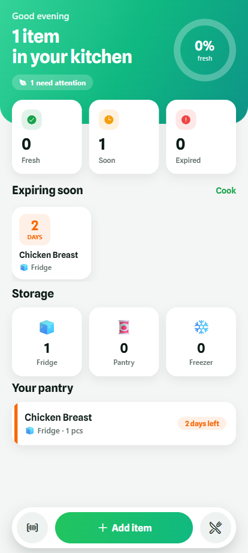
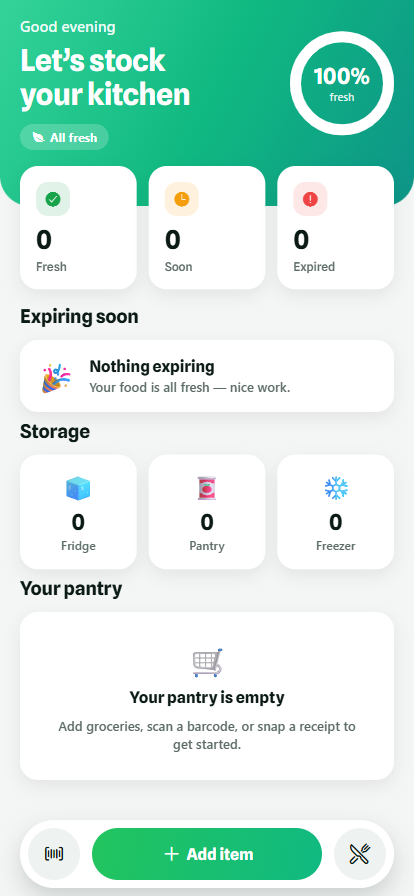

# 🥬 FridgeForage

**A smart ingredient-expiry tracker that fights food waste.** Snap a photo of
your fridge, scan a receipt, or type an item — FridgeForage figures out how long
each item stays fresh, reminds you before it expires, and generates a recipe to
use up what's about to go bad.

> Built with React Native (Expo SDK 56), TypeScript, SQLite, and Google Gemini.
> Local-first and offline-capable, with AI used only as a careful fallback.

---

## Screenshots

<p align="center">
  
  &nbsp;
  
</p>

<p align="center"><em>Animated dashboard — freshness ring, count-up stats, expiring-soon carousel, storage breakdown, and a floating action bar. Shown here in the web build.</em></p>

## Why this project is interesting (the engineering story)

The headline feature is mundane — track groceries. The interesting part is the
**architecture around an LLM you can't fully trust**:

- **Local-first, AI-last.** Shelf life comes from a bundled USDA-style food
  database first; the LLM is only called when there's no local match. This keeps
  the app fast, cheap, and usable offline.
- **The LLM is treated as untrusted input.** A hallucinated shelf-life for raw
  chicken is a *food-poisoning vector*, not a UX bug. So every AI-produced number
  passes through hard safety clamps (raw poultry/seafood ≤ 2 days, leftovers ≤ 4,
  round **down**, never up) before it can touch the database.
- **Structured output, defensively parsed.** The Gemini call uses a JSON
  `responseSchema` (enums for storage zone / unit), and the client *still*
  re-validates and coerces every field so a bad value can never violate the
  SQLite `CHECK` constraints.
- **The API key never ships in the app.** A tiny Cloudflare Worker holds the
  Gemini key; the app talks only to the Worker.
- **Notifications done right.** One `expires_at` timestamp drives both the
  "expiring soon" list and the reminder (fired 24h before expiry), and the
  scheduler respects the iOS 64-notification cap.

These decisions are documented inline and covered by tests — including one that
caught a real regex bug letting "Strawberries" skip the berry shelf-life cap.

## Features

- 📸 **Scan your fridge → instant recipe** — point the in-app camera at your open
  fridge; Gemini vision identifies the ingredients and suggests a dish you can
  make right now (and optionally adds them to your pantry).
- 🧾 **Receipt photo** → Gemini vision extracts and normalizes the line items.
- ⌨️ **Manual add** with auto shelf-life lookup.
- 🗓️ **Expiry tracking** with traffic-light freshness and local push reminders.
- 🍳 **"Cook something"** — Gemini generates a recipe from your soon-to-expire items.

## Tech stack

| Layer | Tech |
|---|---|
| App | React Native 0.85, Expo SDK 56, Expo Router (file-based) |
| Language | TypeScript (strict) |
| Local storage | expo-sqlite (async API) |
| Device | expo-camera, expo-image-picker, expo-notifications |
| AI | Google Gemini (`gemini-2.5-flash`) via Cloudflare Worker proxy |
| Data | USDA FoodKeeper-style shelf-life seed (ETL pipeline included) |

## Project layout

```
src/app/         Screens (expo-router): pantry, add, edit, fridge, recipe
src/engine/      Core logic — DB, shelf-life lookup, AI client, validation,
                 safety clamps, intake orchestration, notifications
src/lib/         Presentation helpers
proxy/           Cloudflare Worker that holds the Gemini key (worker.js)
prompt/          System prompt + JSON schemas for the AI
etl/             Script to flatten the full USDA FoodKeeper dataset into SQL
test/            Zero-dependency unit tests for the safety-critical modules
```

## Run it

```bash
npm install
npm run typecheck   # tsc --noEmit
npm test            # safety-clamp + validation unit tests (Node test runner)
npm run web         # 🌐 run in your browser at http://localhost:8081
npm start           # Expo dev server (scan the QR with Expo Go for a device)
```

### Try it in your browser — no phone needed
`npm run web` runs the full app through `react-native-web`. On web, SQLite is
swapped for a `localStorage`-backed store and OS notifications become no-ops (see
the `*.web.ts` files in `src/engine/`), so you can exercise the entire UI and data
flow before ever building the native APK. AI features still call the proxy when
it's configured.

See **[BUILD.md](BUILD.md)** for deploying the AI proxy and building the
installable Android APK with EAS.

## Status

Engine, UI, and build pipeline complete and verified (typecheck ✅, Android
bundle ✅, tests 18/18 ✅).

**Recent additions:**
- ✅ Scan-your-fridge flow — live in-app camera → AI ingredient detection → recipe
- ✅ Web build — run the whole app in a browser via `react-native-web` (localStorage + no-op shims)
- ✅ Edit-item screen (tap any item to edit name, quantity, unit, zone, shelf life)
- ✅ Search and filter on inventory (text search + zone chips)
- ✅ Swipe-to-delete gesture on inventory items
- ✅ Notification re-scheduling on app foreground
- ✅ Recipe screen empty-state CTA

**Roadmap:** on-device receipt OCR, home-screen widget.
